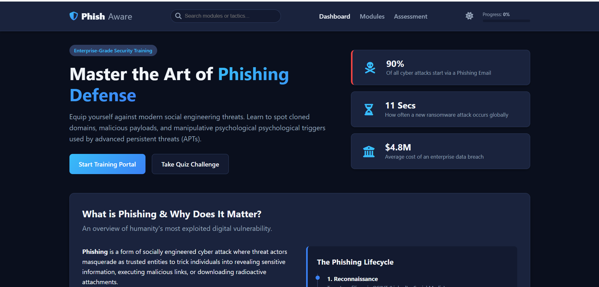
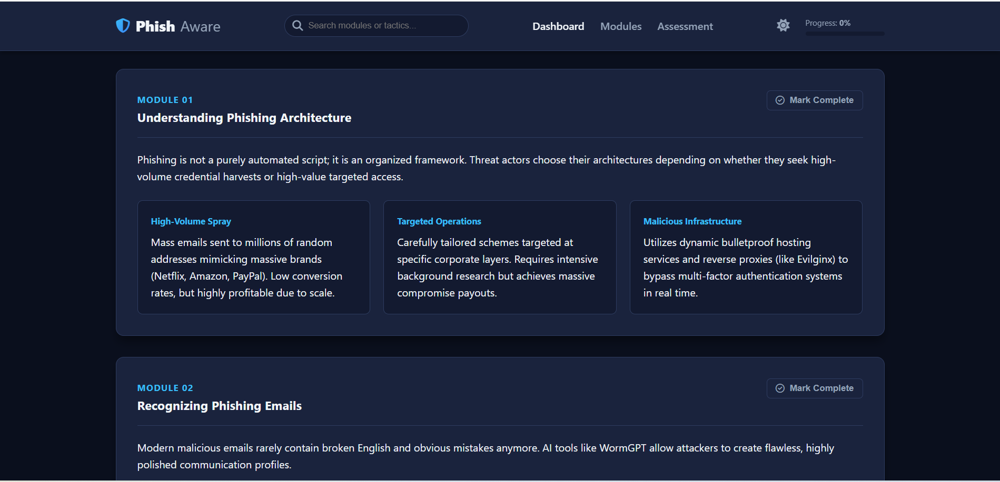
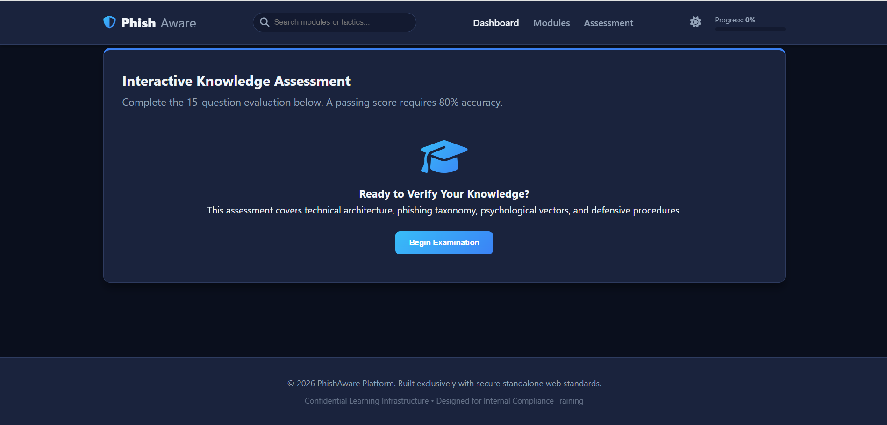

# 🛡️ Phishing Awareness Training Website

A modern and interactive cybersecurity awareness website designed to educate users about phishing attacks, fake websites, social engineering tactics, and online safety best practices.

This project helps users learn how cybercriminals conduct phishing attacks and how to recognize and avoid common online threats through educational modules and interactive quizzes.

---

## 📌 Project Overview

Phishing remains one of the most common cyber attacks worldwide. This website provides awareness training by explaining:

- What phishing is
- How phishing attacks work
- How to identify phishing emails
- How to detect fake websites
- Common social engineering tactics
- Different types of phishing attacks
- Real-world phishing examples
- Cybersecurity best practices
- Interactive knowledge assessment through quizzes

---


 **Live Demo** [click here](https://lavanya-cys.github.io/CodeAlpha_phishing-awareness-training/)

---

## ✨ Features

### 🏠 Home Module
- Introduction to phishing attacks
- Importance of cybersecurity awareness
- Common attack statistics
- Learning objectives

### 📧 Phishing Email Recognition
Learn how to identify:
- Suspicious sender addresses
- Urgent or threatening messages
- Fake attachments
- Malicious links
- Spoofed company emails

### 🌐 Fake Website Detection
Learn how attackers create fake websites and:
- Domain spoofing techniques
- URL manipulation
- Website cloning
- HTTPS misconceptions
- Login page fraud

### 🧠 Social Engineering Awareness
Understand attacker manipulation techniques:
- Authority
- Fear
- Urgency
- Curiosity
- Trust
- Scarcity

### 🎯 Types of Phishing Covered

- Email Phishing
- Spear Phishing
- Whaling
- Smishing (SMS Phishing)
- Vishing (Voice Phishing)
- Clone Phishing
- Social Media Phishing
- Business Email Compromise (BEC)

Each type includes:
- Definition
- Attack methodology
- Examples
- Prevention methods

### 🌍 Real-World Phishing Examples

Includes awareness content based on:

- Banking phishing scams
- KYC update scams
- Social media phishing
- Business Email Compromise attacks
- Fake prize and giveaway scams

### 🔐 Cybersecurity Best Practices

- Enable Two-Factor Authentication (2FA)
- Verify links before clicking
- Use strong passwords
- Keep software updated
- Avoid sharing OTPs
- Verify suspicious communications

### 🧠 Interactive Quiz

Features:
- Multiple-choice questions
- Instant feedback
- Correct answer explanation
- Learning-focused assessment
- User engagement and awareness testing

---

## 🛠️ Technologies Used

| Technology | Purpose |
|------------|----------|
| HTML5 | Structure |
| CSS3 | Styling & Responsive Design |
| JavaScript | Interactivity & Quiz Functionality |

---

## 📂 Project Structure

```text
Phishing-Awareness-Training/
│
├── index.html
├── style.css
├── script.js
├── README.md
└── screenshots/
    ├── home.png
    ├── phishing.png
    └── quiz.png
```

---

## 🚀 How to Run

### Option 1

1. Download the project files
2. Open `index.html`
3. The website will run in your browser

### Option 2

Clone the repository:

```bash
git clone https://github.com/lavanya-cys/CodeAlpha_phishing-awareness-training.git
```

Open:

```text
index.html
```

No installation or dependencies are required.

---

## 📸 Screenshots

### Home Page



### Modules



### Quiz Module




## 🎓 Learning Outcomes

After completing this training, users will be able to:

✅ Understand phishing attack techniques

✅ Recognize phishing emails

✅ Detect fake websites

✅ Identify social engineering tactics

✅ Apply cybersecurity best practices

✅ Reduce the risk of becoming a phishing victim

---


## 🔮 Future Improvements

- Progress Tracking
- User Authentication
- Dark / Light Mode
- Phishing Simulation Lab
- Advanced Quiz Analytics


---

## 🎯 Educational Purpose

This project was developed for cybersecurity awareness and educational purposes to help users understand phishing attacks and improve online security practices.

---

## 👩‍💻 Author

**Lavanya**

Cybersecurity Enthusiast 

---
